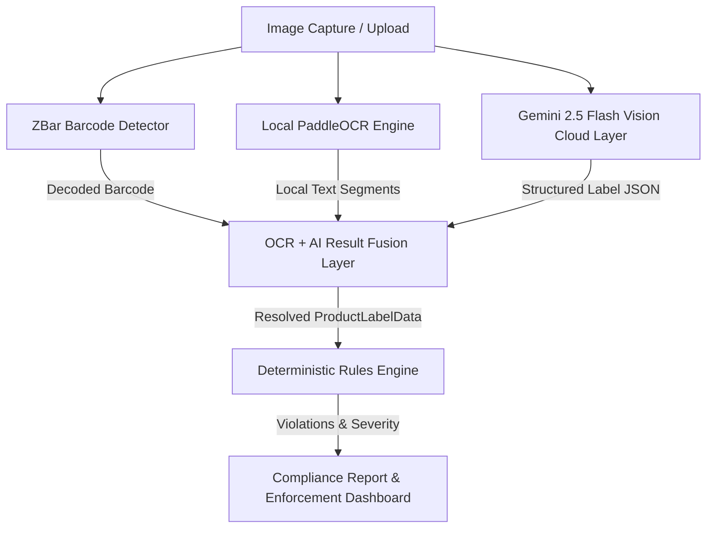

# LegalMetriX - Legal Metrology Compliance Checker

A production-grade, full-stack web application designed for enforcement officers to scan packaged commodity labels, extract mandatory declarations under the **Legal Metrology (Packaged Commodities) Rules, 2011**, and evaluate compliance using a deterministic rule engine powered by a hybrid **Local OCR + Cloud AI Vision Fusion Layer**.

---

## 🏗️ Architecture

LegalMetriX integrates local sensors and edge processing with cloud intelligence to form a highly accurate compliance pipeline.



1. **Client / Frontend:** React-based single page application (SPA) compiled with Vite. Includes an interactive 3-stage scanning wizard, geolocation capture, and real-time review panel.
2. **FastAPI Backend:** Orchestrates image upload, barcode scanning, OCR detection, LLM structured extraction, result fusion, database persistence (SQLite/Postgres), and PDF report generation.
3. **Detection Core:**
   - **Local OCR:** PaddleOCR extracts localized raw text blocks.
   - **Barcode Decoder:** PyZBar / OpenCV detects and decodes EAN-13 and UPC barcodes.
   - **Cloud AI Vision:** Google Gemini 2.5 Flash analyzes text wrapping, orientation, and layout to parse label variables using structured Pydantic models.
4. **Fusion Engine:** Merges OCR, barcode, and Gemini extractions. Automatically identifies conflicts, resolves source attributions, and computes confidence.
5. **Deterministic Rule Engine:** Validates resolved parameters against Legal Metrology Rules, 2011 (LMR codes) and FSSAI standards.

---

## ⚡ Gemini API Integration

The application utilizes the **official Google GenAI Python SDK (`google-genai`)** to leverage `gemini-2.5-flash`.
- Structured output is enforced using Pydantic schemas (`GeminiProductLabelData`), returning strict JSON matching the schema definitions directly from the Gemini API.
- **Accuracy Safeguard:** Gemini is instructed **never to guess** or invent values. If a label parameter is blurry, truncated, or absent, it returns `null` and registers the field name under `uncertain_fields`.
- **API Key Security:** The backend executes all Gemini requests. The frontend has no access to the API key, and it is never exposed in client bundles.

---

## ⚙️ Environment Setup

Create a `.env` file inside the `backend` folder to configure your environment variables.

```env
# Gemini API Key (Required for Cloud Vision Layer)
GEMINI_API_KEY=your_gemini_api_key_here

# Database URL (Defaults to SQLite in-memory/file if not set)
DATABASE_URL=sqlite:///./legalmetrix.db
```

Ensure `.env` is listed in your `.gitignore` to prevent committing secrets to source control.

---

## 🔍 How Image Scanning & Fusion Works

```
Image Upload
   │
   ├──> pyzbar (Fast barcode decode)
   ├──> PaddleOCR (Fast local raw text OCR)
   └──> Gemini API (Cloud Vision structured LLM extraction)
           │
           ▼
     [Fusion Engine]
```

### 1. Merging & Resolution Strategy
For each metrology declaration (e.g., MRP, Net Quantity, Expiry, Manufacturer Address):
- **Barcodes:** Decoded values from PyZBar are trusted natively. Gemini cannot override a barcode value.
- **High-Confidence Match (Agreed):** If PaddleOCR regex-extraction and Gemini parse values that normalize identically, the value is auto-accepted with **High Confidence** and tagged `Double-Verified`.
- **Single Source Resolution:** If only one engine extracts the field, it is accepted with **Medium Confidence** and tagged either `Local OCR` or `Gemini AI`.
- **Conflict Flagging:** If both engines extract values that do not match, the value is marked as a **Conflict** with **Low Confidence** and is flagged for manual officer verification.

### 2. Rule Evaluation
Once variables are resolved, the **Rules Engine** evaluates rules deterministically:
- **`LMR_001` (Product Name):** Must be declared.
- **`LMR_002` / `LMR_003` (Manufacturer Name/Address):** Complete name and address must be visible.
- **`LMR_004` (Net Quantity):** Valid value and standard unit format check (g, kg, ml, L).
- **`LMR_005` (MRP):** Clear Rupees declaration, formatting check, and numeric verification.
- **`LMR_006` / `LMR_007` (Mfg/Expiry Dates):** Month and year validation, expiry/best-before presence.
- **`LMR_008` (Consumer Care):** Requires helpline phone, address, or email contacts.
- **`FSSAI_001` (FSSAI License):** Must be a valid 14-digit number.

---

## 🚨 Manual-Review & Verification Flow

Enforcement officers are in absolute control of legal compliance verdicts:
1. **Officer Interface:** If a field has a conflict or low-confidence tag, a **`Conflict Detected`** warning panel appears in the UI displaying:
   - Value parsed by Local OCR
   - Value parsed by Gemini AI
2. **One-Click Override:** Officers can click either block to instantly overwrite and choose the correct value, or type a manual correction.
3. **Re-Evaluation:** Clicking **Verify Rules** sends the updated dictionary to the backend where violations are recalculated.
4. **Traceable History:** Scans stored in the audit history display exact resolution sources so legal inspections remain auditable.

---

## 🏃 Running the Application

### Method 1: Using the Interactive Batch Script (Windows Local Dev)
Run the script at the project root to start backend, public SSH tunnels, and build frontend:
```bash
Run_Presentation_App.bat
```

### Method 2: Running Services Manually
#### 1. Start the FastAPI Backend
```bash
cd backend
# Create virtual env if not exists
python -m venv venv
.\venv\Scripts\activate
pip install -r requirements.txt
# Run the server
uvicorn app.main:app --host 0.0.0.0 --port 8000
```
- **API Swagger Documentation:** [http://localhost:8000/docs](http://localhost:8000/docs)

#### 2. Start the React/Vite Frontend
```bash
cd frontend
npm install
npm run dev
```
- **Web App Dashboard:** [http://localhost:5173/](http://localhost:5173/)

---

## 🧪 Testing the Scanner

### Automated Backend Tests
Run the pytest suite to check scanner integration, mock Gemini responses, and fusion/verification handlers:
```bash
cd backend
.\venv\Scripts\activate
python -m pytest
```

### Manual Testing Guidelines
1. Log in to the portal using the default officer account:
   - **Email:** `officer@test.com`
   - **Password:** `password123`
2. Navigate to the **Scan Page** and upload a packaging label image.
3. Observe:
   - **Source Badges:** Hover over field labels to see `Gemini AI`, `Local OCR`, or `Agreed`.
   - **Discrepancy Resolution:** If you uploaded a rotated or blurry label, select from the AI or OCR choice buttons to resolve conflicts.
   - **Compliance Report:** Tap **Download PDF Report** to verify formatting.
